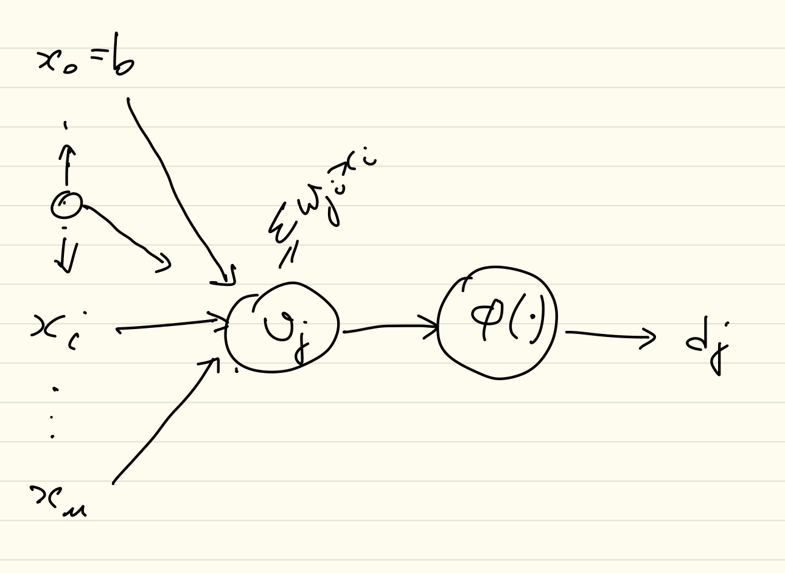

<a href="../index.html">Home</a>


```{r, echo=FALSE}
library(rscala)
library(knitr)
cp <- getwd()
includes <- list.files(file.path(cp, "../target/scala-2.12"), full.names=TRUE)
# ... args passed to rscala::scala functions. See ?rscala::scala for more informations.
make_scala_engine <- function(...) {
 
  engine <- scala(serialize.output = TRUE, stdout = "", JARs=includes)
  engine <- force(engine)
  function(options) {
    code <- paste(options$code, collapse = "\n")
    output <- capture.output(invisible(engine + code))
    engine_output(options, options$code, output)
  }
}

# Register new engine in knitr
knit_engines$set(scala = make_scala_engine())

```


## Overview

The neural network model is a connectionist model inspired by the concept of activating neurons in the brain, where multiple "neurons" or units are activated by an activation function, which takes as input linear combination of weights and the previous layer inputs. While not being a realistic depiction of the brain, there is a loose resemblence in that the strength of the connections or weights between units resembles the strength of synapses between neurons.

As examples are fed forward into each layer of the network, the units in each layer are "activated" through an activation function and the output is then linearly combined with the weights between the current layer and the next and fed into the subsequent activation functions until the output layer. A loss function is used to calculate the distance between the output of the network and the desired target variables, and the loss function derivative along with the local activation function derivative is then used to calculate small changes in the weights in order to propogate those changes at each subsequent layer. This is performed as an application of the chain rule for differentiation in the first order optimisation method "stochastic gradient descent" (SGD). The gradient method makes small changes that follows the derivative of the error in order to search for a global minima. One issue with gradient descent is that it can easily be caught in local minima and not reach the global optimum values.

Initialisation of the network weights is generally performed using heuristic methods, however weights are required to be independently randomly distributed. 

The data that is fed into the network is numeric in nature, the challenge is in finding a representation for the input data that will be suitable for the network to learn. Continuous multivariate data is normalised, and categorical data is encoded as an appropriate representation such as a simple index mapping, or potentially an embedding representation (although the networks are also used to learn embedding representations). 




The linear combination at each layer is given as $\nu = W^TX + b$ this is then passed through the activation function $y = \phi(\nu)$ to produce the output of the layer. 

$$
\nu_j^{(l)} =  \sum_{i=0}^m w_{ij}^{(l)}y_i^{(l-1)}
$$

The activation of the neuron $j$, $y_j^{(l)}$ is given as 

$$
y_j^{(l)} = \begin{cases}
  x_j & \text{ where } l = 0, x_j \text{ is an input node}\\
  \phi_j(v_j) & \text{ where } l > 0
\end{cases}
$$

A multilayer network consists of an input layer, intermediate "hidden" layers and an output layer. In the case of a simple three layer network we
can refer to the units in the input layer as units $i$ the units in the hidden layer as units  $j$ and units in the output layer as units $k$. The weights between each layer as $w_{ji}$ for weights between input and hidden layer, and $w_{kj}$ for weights between the hidden and output layer.

The input layer doesn't really have an activation function as such, in this case it can be treated as the identity function. The requirement of activation and loss functions are that they are continuous and differentiable. Normalisation of network inputs and targets can be helpful in this respect. 


In the SGD learning algorithm the network is fit in two stages, a forward pass and a backward pass.

The forward pass is the same as prediction, hence data is fed into each layer subsequently it is a composition of activation functions. For example in the simple 3 layer network we have 2 activation functions and one input layer with weight matrices between input $i$ and layer 1 units $j$ ($W_{ji}$), as well as weight matrices between hidden layer 1 units $j$ and output layer 2 units $k$ ($W_{kj}$). With respective activation functions $\sigma_j$ for each unit $j$ in hidden layer 1 and $\phi_k$ for each unit $k$ in the output layer 2.

$$
f_{net} = \phi_k(W_{kj}^T\phi_j(W_{ji}^T [X \text{ } b])) = \phi_k(\nu_k)
$$


The input matrix consists of an additional column $b$ which is a bias term introduced for the linear activation of the input, this is generally a column of ones. The bias is also added to the weight matrices in subsequent layers so that it is propagated through the network. As the data is transformed on the input space, via a method of normalisation, the output of the network also needs to have the inverse transform applied in order to rescale it into the original units of the data set. This is typically performed during assessment of the network performance so that metrics depending on units can be interpreted.

During training a loss function $\mathcal{E}$ is used to calculate the loss for the batch as well as its derivative which gives the gradient of the error signal. The loss function is continuous and differentiable. Common loss functions are $L^2 = \frac{1}{2n}\sum_{i=1}^n (y - \hat{y})^2$ and the Cross Entropy function for comparison of discrete probability distributions generated by the network and the target probability distribution for the example. 

The gradient descent method uses the derivative of the loss function with respect to the weights in order to determine the changes that need to be made to the weights within the network.

$$
\frac{\partial \mathcal{E}}{\partial w_{ji}} = \frac{\partial \mathcal{E}}{\partial e_j}\frac{\partial e_j}{\partial y_j}\frac{\partial y_j}{\partial \nu_j}\frac{\partial \nu_j}{\partial w_{ji}}
$$
It is the application of the chain rule with respect to the weights and the composed functions of the network.

Haykin @Haykin indicates that the partial derivative $\frac{\partial \mathcal{E}}{\partial w_{ji}}$ represents a sensitivity factor which determines the direction of search in the weight space for the update to weight $w_{ji}$. In effect it determines the direction the weight will be adjusted. 

The back propogation is separated into two tasks, the first task is in determining the gradient:

$$
\delta_j = \frac{\partial \mathcal{E}}{\partial \nu_j} = \frac{\partial \mathcal{E}}{\partial e_j}\frac{\partial e_j}{\partial y_j}\frac{\partial y_j}{\partial \nu_j}
$$
Which is calculated depending on the layer of the network as shown below.
$$
\delta_j = \begin{cases}
e_j^{(L)}\phi_j'(v_j^{(l)}) & \text{ neuron } j \text{ in output layer } L\\
\phi_j'(v_j^{(l)})\sum_k \delta_k^{(l+1)}w_{kj}^{(l+1)} & \text{ neuron } j \text{ in hidden layer } l
\end{cases}
$$

The second part is in adjusting the weights at the connection between neuron $j$ in layer $l$ and neuron $i$ in the previous layer $l-1$ as follows.

$$
w_{ji}^{(l)} = w_{ji}^{(l)} + \eta \delta_j^{(l)} y_i^{(l-1)}
$$ 

The hyperparameter $\eta$ is specified prior to training (and needs to be determined empirically), it is also possible to use a dampening effect for updates made in previous weight updates by including a momentum term. 

A second hyper parameter $\alpha$ is used to provide a decay for the influence of the previous iterations weights at iteration $n-1$.
The notation here introduces the term $n$ for the current iteration of the learning epoch.
$$
w_{ji}^{(l)}(n) = w_{ji}^{(l)}(n) + \alpha[w_{ij}^{(l)}(n-1)] + \eta \delta_j^{(l)} y_i^{(l-1)}(n)
$$
The hyperparameter momentum $\alpha \in [0,1]$ is described by Goodfellow et al in "Deep Learning" 2016 @Goodfellow as an analogy for the velocity vector of a particle. The parameter determines how quickly contributions of previous gradients exponentially decay. 

Learning continues until completing all epochs or until a stopping condition is met.

Other optimisation methods make use of second order derivatives or approximations of second order derivatives in order to perform weight updates, these are not addressed in the implementation at this stage.

The above does not describe in detail the choice of activation functions, these depend on the type of application applied in the network. Popular choices of activation function for hidden layers include the "Restricted Linear Unit (Relu)" or the Sigmoid unit.

## Library Implementation Examples

The au.id.cxd.math library implements a simple means of training networks with stocastic gradient descent, however this is for demonstration purposes, industrial applications should make use of tools such as tensorflow or pytorch for example. 

The library provides activation functions for sigmoid, tanh, Relu, Linear and Softmax, as well as loss functions for Mean Squared Error for use with continuous data and Cross Entropy for discrete probabilities.


The following sections provide an example of two simple networks, one used for regression and the other for classification of multiple classes.

## Neural Network Model for Regression

This model is a simple 3 layer network that will be used to predict the miles-per-gallon from the cars data set based on other continuous features of each model.


```{r, engine='scala', echo=FALSE, message=FALSE, results='hide'}

import java.io._
import breeze.linalg._

def toCsv[A](path:String, items:Seq[A]) {
  val writer = new PrintWriter(new File(path))
  val data = items.mkString("\n")
  writer.write(data)
  writer.flush()
  writer.close()
}

def writeMatCsv(path:String, m:DenseMatrix[Double]):Unit = {
  val file = new java.io.File(path)
  csvwrite(file, m, separator=',')
}
```


```{r, engine='scala', echo=FALSE}
val basePath ="/Users/cd/Projects/scala/scala-au.id.cxd.math-gh-pages/scala-au.id.cxd.math"
```


The first step is to define some convenience functions that will help us to load the data and partition it.

```{r, engine='scala', message=FALSE, results='hide'}
import au.id.cxd.math.data.{MatrixReader, Partition}
import au.id.cxd.math.function.transform.StandardisedNormalisation
import au.id.cxd.math.model.evaluation.{Efficiency, MAE, MSE, PeakPercentDeviation, RSquared, WillmotsIndex}
import au.id.cxd.math.model.network.activation.{Identity, LeakyRelu, Linear, Relu, Sigmoid}
import au.id.cxd.math.model.network.builder.{Builder, Sequence}
import au.id.cxd.math.model.network.initialisation.RandomWeightInitialisation
import au.id.cxd.math.model.network.layers.{DenseLayer, InputLayer}
import au.id.cxd.math.model.network.train.SGDTrainer
import au.id.cxd.math.probability.regression.{BayesLinearRegression, OrdLeastSquares}


val inputFile = s"$basePath/data/cars/autompg2.csv"


def readCars(inputFile:String): (StandardisedNormalisation, DenseMatrix[Double], DenseMatrix[Double]) = {
    val reader = new MatrixReader {}
    val M = reader.read(new File(inputFile))
    // normalise M
    val normal = new StandardisedNormalisation()
    val M1 = normal.transform(M)
    val continuous = Seq(2,3,4,5)
    val X = M1(::, continuous)
    val Y = M1(::, 0)
    (normal, X.toDenseMatrix, Y.toDenseMatrix.t)
}


def translateY(data:DenseMatrix[Double], norm:StandardisedNormalisation):DenseMatrix[Double] = {
    val mu = norm.meanVector
    val std = norm.sigmaVector
    val ycol = 0
    val mu2 = DenseVector(mu(0))
    val std2 = DenseVector(std(0))
    val norm2 = new StandardisedNormalisation()
    norm2.meanVector = mu2
    norm2.sigmaVector = std2
    norm2.invert(data)
}

def partition(X:DenseMatrix[Double], Y:DenseMatrix[Double]):Seq[(DenseMatrix[Double], DenseMatrix[Double], DenseMatrix[Double])] = {
    val partitions = Partition(Seq(X, Y))
    partitions
}

```

Next we load the data file.

```{r, engine='scala', message=FALSE, results='hide'}
val (norm, x, y) = readCars(inputFile)
val partitions = partition(x,y)

val trainX = partitions(0)._1
val validX = partitions(0)._2
val testX = partitions(0)._3

val trainY = partitions(1)._1
val validY = partitions(1)._2
val testY = partitions(1)._3
```

The partitions have been generated, the default proportions for the 'Partition' object are 60% training, 20% validation and 20% testing.

The next step is to define a network architecture, in this case the network has one input layer of 4 inputs, one hidden layer with 4 units and one output layer with a single unit. A helper function is written to provide the network architecture.

```{r, engine='scala', message=FALSE, results='hide'}
  /**
    * create a simple network
    * @return
    */
  def buildNetwork():Builder = {
    Sequence(Seq(
      InputLayer(activation=Identity(), units=4),
      DenseLayer(activation=Relu(), units=4),
      DenseLayer(activation=Linear(), units=1)
    )).compile()
  }


```

A training algorithm is supplied, in this case there is one to choose from, the SGD training algortihm, with a low learning rate and momentum. The low learning rate is selected because to avoid learning too quickly and resulting in overflow or underflow errors which have not been addressed in this example implementation. Similarly the momentum is provided as a low value to prevent the previous history of weight updates from causing similar underflow or overflow issues during the training algorithm. Note when using more robust tools such as tensorflow this may not be as much of a consideration to deal with.

```{r, engine='scala', message=FALSE, results='hide'}

val trainer = SGDTrainer(trainX, trainY, validX, validY, learnRate = 0.000001, momentum=0.000001)

```

The trainer is then used to train the network, it returns a new network containing the resulting weights and the training loss and validation loss metrics for each epoch.
The network is trained for 2000 epochs.

```{r, engine='scala', message=FALSE, results='hide'}

val (loss, valloss, network2) = trainer.train(2000)(buildNetwork().asInstanceOf[Sequence])

```

```{r, engine='scala', echo=FALSE, message=FALSE, results='hide'}
// write results to file to plot in R.
val losses = DenseMatrix.horzcat(DenseVector(loss.toArray).toDenseMatrix.t, DenseVector(valloss.toArray).toDenseMatrix.t)

writeMatCsv(s"$basePath/temp/net01_train.csv", losses)
```

The training and validation loss is shown below, interestingly the validation loss is lower than the training loss. Also note that the loss continues to decrease throughout the training process, although near the end the training loss begins to increase slightly.

```{r, echo=FALSE}
losses <- read.csv("../temp/net01_train.csv")
colnames(losses) <- c("train_loss", "val_loss")
minL <- min(losses[,1], losses[,2])
maxL <- max(losses[,1], losses[,2])
plot(1:nrow(losses), losses[,1], ylim=c(minL - 0.5,maxL + 0.5), col="blue", xlab="epoch", ylab="train loss", type='l')
lines(1:nrow(losses), losses[,2], col="red")
#points(1:nrow(losses), losses[,2], col="red")
legend("topright", col=c("blue", "red"), legend=c("train loss", "val loss"), pch=1, lwd=2)

```

In order to evaluate the network we can use a range of metrics, these include $R^2 \in [0, 1]$ the percent variance explained (in the linear relationship), Willmott's Index of Agreement $d \in [0, 1]$, Nash-Sutcliffe Efficiency $E \in [-\infty, 1]$, Mean Absolute Error (in the same units as the target unit), Root Mean Absolute Error (also in the same units) and Peak Percentage Deviation (also in the sames units as the target), in order to gain an insight into the performance of the model. 

To calculate the metrics we first obtain an approximation from the network.
```{r, engine='scala', message=FALSE, results='hide'}

val sim = network2.predict(testX)

```

We can plot this prediction as well as the residuals just as we do in standard regression.

```{r, engine='scala', message=FALSE, results='hide', echo=FALSE}

val targets = testY(::,0).toDenseMatrix
val target2 = translateY(targets.t, norm)
val sim2 = translateY(sim, norm)
val targetSim = DenseMatrix.horzcat(target2, sim2)
writeMatCsv(s"$basePath/temp/net01_predict.csv", targetSim)
```

```{r, echo=FALSE}
targetSim1 <- read.csv("../temp/net01_predict.csv")
colnames(targetSim1) <- c("obs", "sim")
plot(1:nrow(targetSim1), targetSim1$obs, col="blue", xlab="n", ylab="obs", type="b", main="Regression miles per gallon via Neural net")
lines(1:nrow(targetSim1), targetSim1$sim, col="red")
points(1:nrow(targetSim1), targetSim1$sim, col="red")
legend("topright", col=c("blue", "red"), legend=c("observed", "simulated"), pch=1, lwd=2)

```

```{r, echo=FALSE, fig.width=5, fig.height=7}
resid <- targetSim1$obs - targetSim1$sim
par.old <- par(mfrow=c(3,1))
plot(resid)
hist(resid)
qqnorm(resid, col="blue", main="Q-Q Plot for residuals")
qqline(resid, col="red")
par(par.old)
```

The residuals appear to be almost normally distributed with some skew towards the lower values. Visually we can say the model deviates somewhat for lower values.

The metrics for the model are generated as follows.

```{r, engine='scala', message=FALSE}
def printMetrics(metrics:Map[String,Double]) = {
    metrics.foreach {
      pair => {
        println(s"${pair._1} : ${pair._2}")
      }
    }
}

val metrics1 = Map(
      "RSquared" -> RSquared(target2.toArray.toSeq, sim2.toArray.toSeq),
      "Agreement" -> WillmotsIndex(2.0, target2.toArray.toSeq, sim2.toArray.toSeq),
      "Efficiency" -> Efficiency(2.0, target2.toArray.toSeq, sim2.toArray.toSeq),
      "MAE" -> MAE(target2.toArray.toSeq, sim2.toArray.toSeq),
      "MSE" -> MSE(target2.toArray.toSeq, sim2.toArray.toSeq),
      "PDV" -> PeakPercentDeviation(target2.toArray.toSeq, sim2.toArray.toSeq)
)

println("Network model")
printMetrics(metrics1)
```

Note that the R-squared indicates the model explains roughly 1.2% of variation, the agreement is roughly close to the mean, the MSE about 49 miles per gallon (given the data we are predicting) and the mean absoluate error MAE is about 5.6 miles per gallon.

We can generate another model using ordinary least squares and compare using the same metrics.

```{r, engine='scala', message=FALSE, results='hide'}

// compare with OLS
val ols1 = OrdLeastSquares(trainX, trainY.toDenseVector, 1)
val (est1, error1) = ols1.train()
// prediction before update
val Y1 = ols1.predict(testX)
// rescale the simulated data
val sim4 = translateY(Y1.t, norm)
```


```{r, engine='scala', message=FALSE, results='hide', echo=FALSE}

val targetSim2 = DenseMatrix.horzcat(target2, sim4)
writeMatCsv(s"$basePath/temp/net01_predict2.csv", targetSim2)

```

```{r, echo=FALSE}
targetSim2 <- read.csv("../temp/net01_predict2.csv")
colnames(targetSim2) <- c("obs", "sim")
plot(1:nrow(targetSim2), targetSim2$obs, col="blue", xlab="n", ylab="obs", type="b", main="Regression miles per gallon via OLS")
lines(1:nrow(targetSim2), targetSim2$sim, col="red")
points(1:nrow(targetSim2), targetSim2$sim, col="red")
legend("topright", col=c("blue", "red"), legend=c("observed", "simulated"), pch=1, lwd=2)

```


```{r, echo=FALSE, fig.width=5, fig.height=7}
resid2 <- targetSim2$obs - targetSim2$sim
par.old <- par(mfrow=c(3,1))
plot(resid2)
hist(resid2)
qqnorm(resid2, col="blue", main="Q-Q Plot for residuals of OLS")
qqline(resid2, col="red")
par(par.old)
```

Looking at the residuals the OLS model appears to be skewed to the right with predictions in the upper range having more errors than the lower to mid range.

We can obtain metrics for the model to compare to the original neural network model.


```{r, engine='scala', message=FALSE, results='hide'}

val metrics2 = Map(
      "RSquared" -> RSquared(targets.toArray.toSeq, Y1.toArray.toSeq),
      "Agreement" -> WillmotsIndex(2.0, targets.toArray.toSeq, Y1.toArray.toSeq),
      "Efficiency" -> Efficiency(2.0, targets.toArray.toSeq, Y1.toArray.toSeq),
      "MAE" -> MAE(target2.toArray.toSeq, sim4.toArray.toSeq),
      "MSE" -> MSE(target2.toArray.toSeq, sim4.toArray.toSeq),
      "PDV" -> PeakPercentDeviation(target2.toArray.toSeq, sim4.toArray.toSeq)
    )

println("Bayes OLS model")
printMetrics(metrics2)
```

Reviewing the OLS model, it has an efficiency lower than the first model, however both models have a negative efficiency which indicates that they do not predict anymore skillfully than the simply using the mean value on this data set. However the second model has a higher MAE as well as a higher MSE as well as a higher PDV which indicates the first model is slightly more skillful a prediction than the second.

## References.


